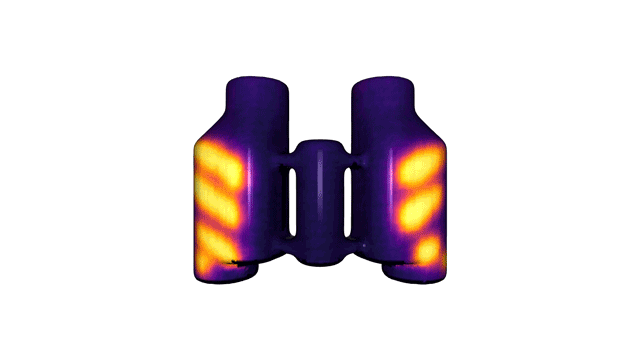

# [ContactDB: Analyzing and Predicting Grasp Contact via Thermal Imaging](https://contactdb.cc.gatech.edu)
This repository contains code to create the human grasp contact maps, presented in the paper 

[ContactDB: Analyzing and Predicting Grasp Contact via Thermal Imaging](https://contactdb.cc.gatech.edu) - [Samarth Brahmbhatt](https://samarth-robo.github.io/), [Cusuh Ham](https://cusuh.github.io/), [Charles C. Kemp](http://ckemp.bme.gatech.edu/), and [James Hays](https://www.cc.gatech.edu/~hays/), CVPR 2019

[Paper (CVPR 2019 Oral)](https://arxiv.org/abs/1904.06830) | [Explore the dataset](https://contactdb.cc.gatech.edu/contactdb_explorer.html) | Poster | Slides

Please see [contactdb_prediction](https://github.com/samarth-robo/contactdb_prediction) for code to perform the contactmap prediction experiments presented in the paper.

This code is **in the process of being documented**. Feel free to open an issue if you need urgent help.

## Dataset Download:
We offer both processed and raw forms of the data.
### Processed Data
[Contact Maps (Textured Meshes) (11.5 GB)](https://www.dropbox.com/sh/gzwk21ssod63xdl/AAAJ5StPMS2eid2MnZddBGsca?dl=0). If you also need the RGBD-Thermal images, 6-DOF object poses, and image masks, use [this Dropbox link (91 GB)](https://www.dropbox.com/sh/yjp1s73ollrfafi/AAATWS-1l-MzUcNtahR36fB-a?dl=0) instead.
### Raw Data
[ROS bagfiles (1.46 TB)](https://www.dropbox.com/sh/hn90i9qglddnfpb/AABfB3pd34nkEF7_usktvVLMa?dl=0): Compressed 30 Hz RGB-D-Thermal data streams. You will also need the [Object 3D Models (180 MB)](https://www.dropbox.com/sh/5rnxri7dzh9ciy3/AABXgwqpmBtlXgQc8aWBVl8aa?dl=0) to create contact maps from this raw data.
### 3D Printing
[This spreadsheet](https://docs.google.com/spreadsheets/d/1v1BqZJOKQ0chPYkBFVJvfToLU7KWs-2RRb2tsJ5IDP8/edit?usp=sharing) has
links to 3D models suitable for printing, along with scaling information. We designed a mount for rigidly attaching the FLIR
Boson camera to aa Kinect v2, you can find it
[here](https://drive.google.com/file/d/1b-jSd6bSO9J4HP4xitSNaxbpIfzsovN8/view?usp=sharing).
Note: these models are suitable for 3D printing, but some characteristics like sharp triangles make them unsuitable for texture mapping. Please use the re-meshed `.ply` models from the Processed Data section above for texture mapping. All the object poses, camera poses etc. are defined with respect to those re-meshed models.

## Setup
### Using Processed Data
The repository includes some handy Python scripts in the `scripts` directory. You can ignore all the C++ code.
1. Install [Open3D](http://www.open3d.org/docs/getting_started.html), `numpy`, and `matplotlib`.
2. Download this repository: `git clone https://github.com/samarth-robo/contactdb_utils`.
3. Download the [Processed Data](#processed-data), and make the symlink: `ln -s DOWNLOAD-DIR data/contactdb_data`.
4. If you want to perform machine learning experiments, check out the [contactdb_prediction](https://github.com/samarth-robo/contactdb_prediction) repository.
### Using Raw Data
Our code is a ROS package that has been tested on Ubuntu 16.04 LTS with ROS Kinetic Kame.
1. [Install dependencies](docs/deps.md)
2. Set up a [Catkin workspace](http://wiki.ros.org/catkin/Tutorials/create_a_workspace) in `~/catkin_ws`.
3. Download this repository and [my fork of cv_camera](https://github.com/samarth-robo/cv_camera) and compile the ROS package:
```
$ cd ~/catkin_ws/src
$ git clone https://github.com/samarth-robo/contactdb_utils
$ git clone https://github.com/samarth-robo/cv_camera
$ cd ..
$ catkin_make
```
4. Download [Raw Data and 3D Models](#raw-data), and make symlinks:
`ln -s DATA-DOWNLOAD-DIR data/contactdb_data`, `ln -s 3D-MODEL-DOWNLOAD-DIR data/contactdb_3d_models`.
5. Download and setup the ICP code for object pose estimation:
```
$ git clone https://github.com/samarth-robo/ICP-gui
$ cd ICP-gui
$ mkdir build && cd build && make -j
```
6. Create a symlink to the build directory:
```
$ cd contactdb_utils
$ ln -s <ICP-gui dir>/build ICP_build
```

## Visualizing Contact Maps
This script applies our post-processing to the contact map, and shows it in interactive 3D. You need to either download the processed data, or process the raw data before running it.
```
cd contactdb_utils/scripts
python show_contactmap.py --object_name <object name> --session <participant number 1-50> --instruction <use | handoff>
```
</img>

## Documents:
- [Recording your own data](docs/recording_steps.md)
- [Cleaning up 3D models of objects](docs/3d_model_cleaning.md)
- [Processing the recorded data](docs/processing_steps.md)
- [Various files produced during data processing](docs/data_files.md)

## Citation
```
@inproceedings{brahmbhatt2018contactdb,
  title={{ContactDB: Analyzing and Predicting Grasp Contact via Thermal Imaging}},
  author={Samarth Brahmbhatt and Cusuh Ham and Charles C. Kemp and James Hays},
  booktitle={IEEE Conference on Computer Vision and Pattern Recognition (CVPR)},
  year={2019},
  note={\url{https://contactdb.cc.gatech.edu}}
}
```
