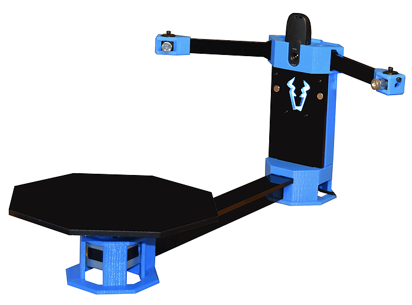

We use the [Cowtech Ciclop 3D scanner](https://www.cowtechengineering.com/3d-scanners) as a **turntable**.

[This file](deps.md#installing-horus-only-needed-if-you-want-to-record-your-own-data) details the software setup for the turntable.
